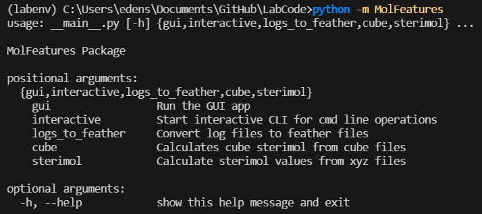
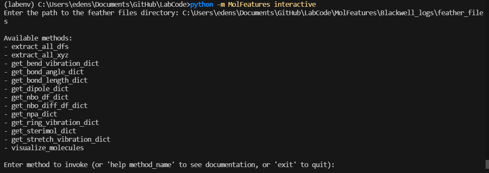
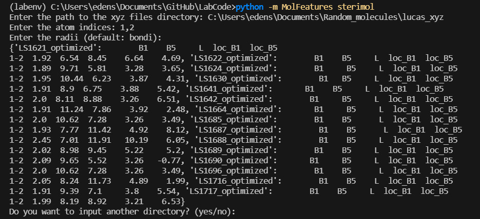

# MolFeatures
# Command Line Usage - Guide

**This guide will demonstrate the use of MolFeatures's stand-alone functionalities.**

Note that there are some additional features that were not included in the GUI and are only available with interactive use. 

```
# to see package options
python -m MolFeatures
```
<center></center>

```
# to start interactive mode
python -m MolFeatures interactive
```

<center></center>

Use help method_name to see clear instruction for each method.
Once picked the appropriate parameters will be asked from the user.
***

## Sterimol from xyz files 

Sterimol parameters can be extracted from xyz files without the need for logs or feather files.

```
# To calculate sterimol features:

python -m sterimol
```
***
<center></center>

## Cube Sterimol

The generation of sterimol values from density cube files is similar in nature to the classic, xyz-based sterimol. The key difference between the two is the reliance of the classic computation on tabulated radii data, which do not account for stereo-electronic variations in atomic radii.

<center></center>
