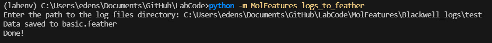
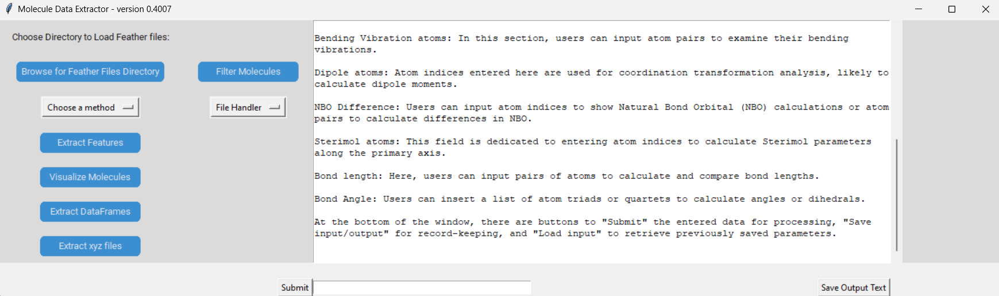
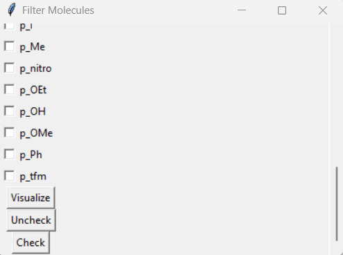
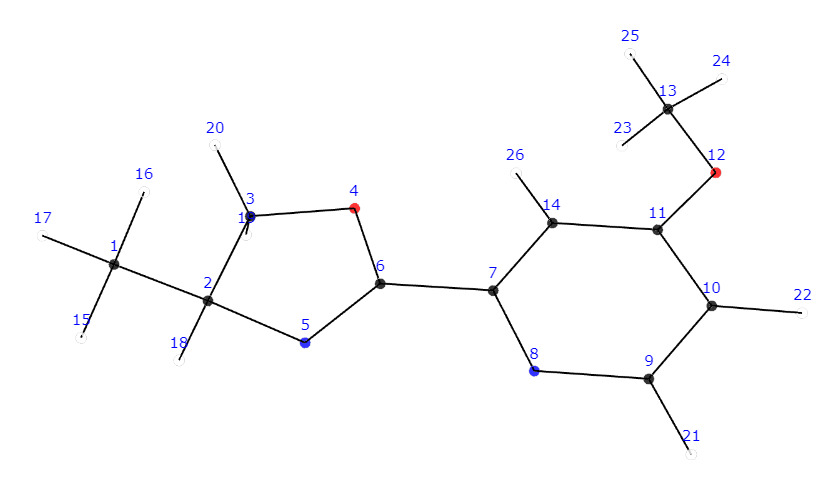
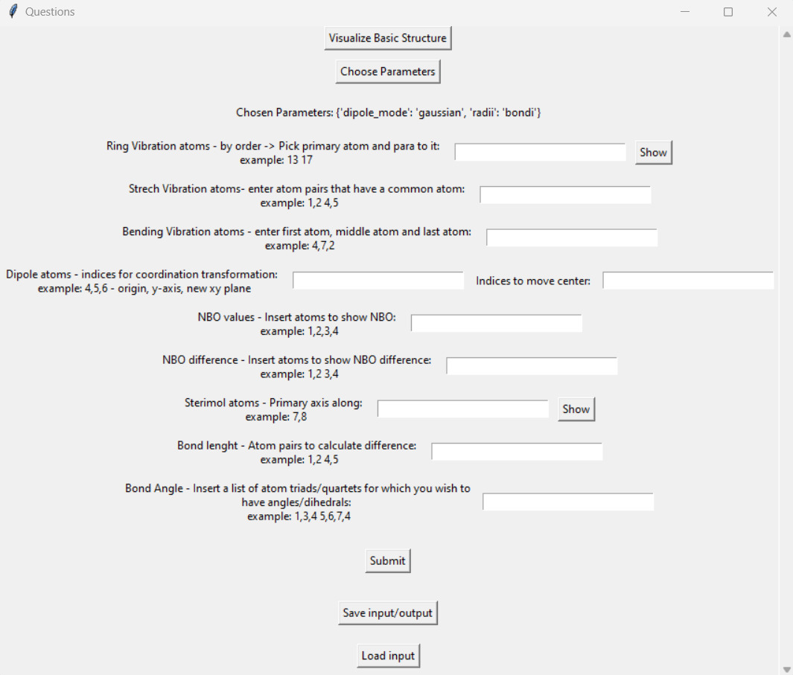
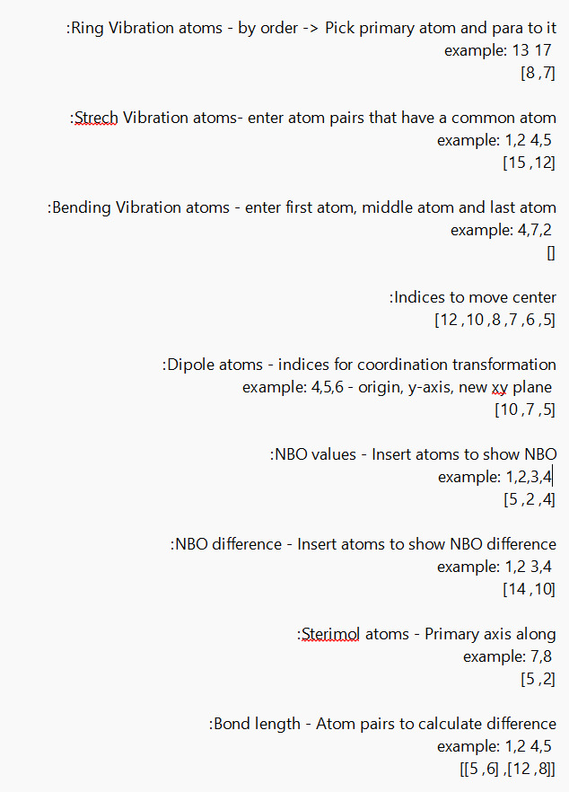

**It is highly recommended to begin by running the following example hand-in-hand with this guide**

## Download example log files

Please find the example log files on the package's [Github]('(https://github.com/edenspec2/LabCode/blob/main/Getting%20started%20with%20examples/Example_log_files.zip)')

Once downloaded and unzipped, you are ready to go!

For user convenience, we demonstrate usage with a small number of molecules, such that downloading the log files directly to a local machine will stay within memory-usage reason. As stated on the home page, it is generally not the case. 

## Run extRactoR

<center></center>

**A directory named 'feather_files' will be created inside the logs directory with the feather files inside it.**
**Now that we extracted the files we can run the GUI for easy feature extraction.**


```{r mol, eval=FALSE}
# Run MolFeatures 
python -m MolFeatures gui
```

<center></center>

**Users are then presented with the option menu.**
**By clicking Browse to feather files directory users can choose a directory with feather files to load them**
**once loaded a list with file names will appear to let you know which files were successful**

```{r mol, eval=FALSE}
Molecules initialized : ['basic', 'm_Br', 'm_Cl', 'm_F', 'm_I', 'm_nitro', 'o_Br', 'o_Cl', 'o_F', 'o_I', 'o_nitro', 'penta_F', 'p_amine', 'p_azide', 'p_boc', 'p_Br', 'p_Cl', 'p_F', 'p_I', 'p_Me', 'p_nitro', 'p_OEt', 'p_OH', 'p_OMe', 'p_Ph', 'p_tfm']

Failed to load Molecules: []
```

Now we can start preforming other actions, lets start with visualizing one of the structures we loaded.
This image will help us select atoms for the process of feature extraction.

<center></center>

<center></center>

## Features

Once we open the Feature Extraction window, we'll be presented with many questions allowing us to extract the different features.

Each of the features and their options are described with an example of what the input should look like.

<center></center>

Visualize Basic Structure - Visalizes the smallest structure in the set.
Choose Parameters - lets you choose 1) radii type that will be used for sterimol.
There are two radii systems implemented in this version, the first being Pyykko's covalent radii and the second being CPK (VDW radii). The default is set to covalent radii as it holds a definitive value for all elements of the periodic table, while CPK is only defined for a small subset of them.
2) Dipole calculation type - either directly from gaussian input or explicitly from the NBO values.

**Once all parameters are entered users can click submit for instant results which will be presented on the GUI dashboard.**
**It is recommended to use Save input/output, once clicked users will be asked to save a text file with the parameters chosen for quick results replication,
in addition a csv file will be saved with the features extracted**

#### Inputs file 

The inputs file is saved in a text format. users can edit the file manualy by changing the indices inside the brackets.
By choosing Load input users can load the file, the indices will appear in the corresponding rubrics.

<center></center>
