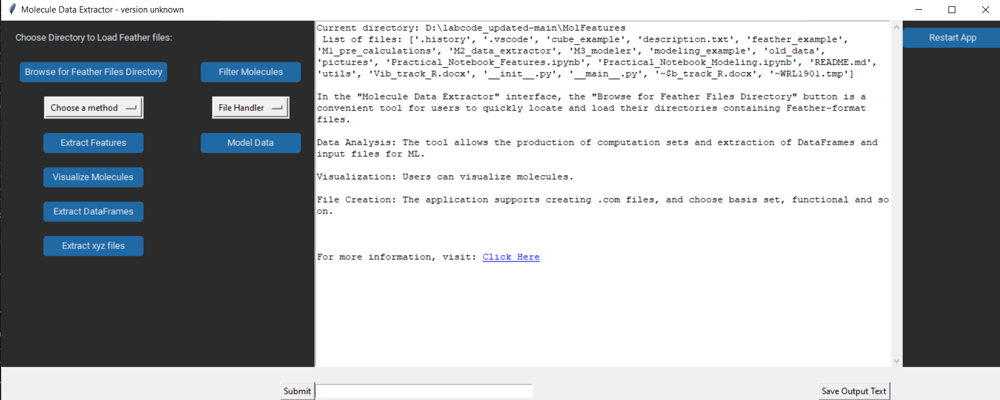
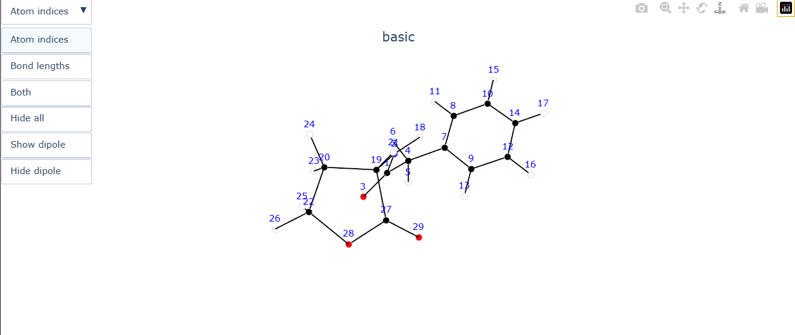
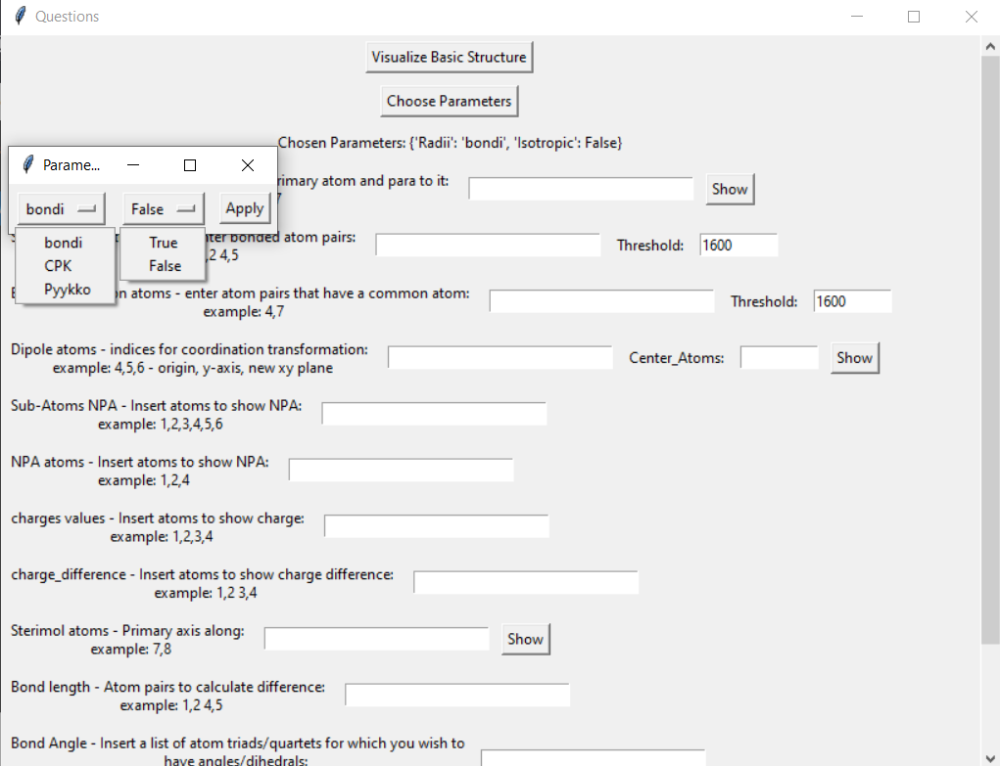
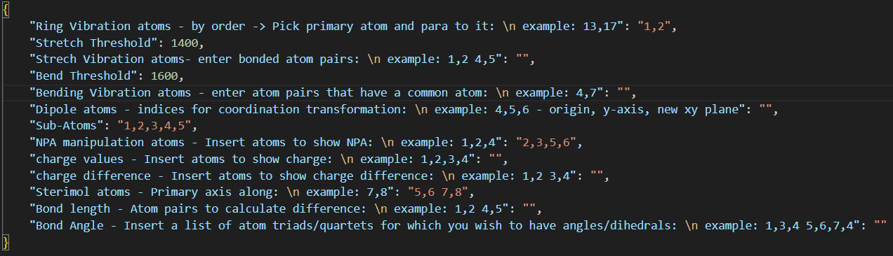
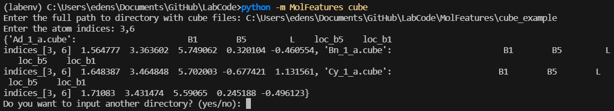

**The following section focuses on the GUI use, for more advanced usage refere to the Practical Notebooks for feature extraction and modeling**

## Opening the GUI app


## Run logs to feather converter


```
# Run the following command in the MolFeatures directory. 
python -m __main__.py gui
```

<center></center>

**Use File Handler to convert log files to feathers, or use the example feather files.**

**Now we can go over to feature extraction.**
**By clicking Browse feather directory users can choose a which molecules to load**
**once loaded a list with file names will appear to let you know which files were successful**

```
Molecules initialized : ['basic', 'm_Br', 'm_Cl', 'm_F', 'm_I', 'm_nitro', 'o_Br', 'o_Cl', 'o_F', 'o_I', 'o_nitro', 'penta_F', 'p_amine', 'p_azide', 'p_boc', 'p_Br', 'p_Cl', 'p_F', 'p_I', 'p_Me', 'p_nitro', 'p_OEt', 'p_OH', 'p_OMe', 'p_Ph', 'p_tfm']

Failed to load Molecules: []
```

Now we can start preforming other actions, lets start with visualizing one of the structures we loaded.
This image will help us select atoms for the process of feature extraction.

<center></center>

<center></center>

## Features

Once we open the Feature Extraction window, we'll be presented with many questions allowing us to extract the different features.

Each of the features and their options are described with an example of what the input should look like.

<center></center>

Visualize Basic Structure - Visalizes the smallest structure in the set.

Choose Parameters - lets you choose 1) radii type that will be used for sterimol.
There are two radii systems implemented in this version, the first being Pyykko's covalent radii and the second being CPK (VDW radii). The default is set to covalent radii as it holds a definitive value for all elements of the periodic table, while CPK is only defined for a small subset of them.

2) Option to include default values in the extracted features.

##**After selecting the parameters, users can input atom indicies for the desired features.
Save input will create a text file with the currently filled parameters and indicies, which can be used with Load input instead of manually filling the questions again.
Clicking submit, the results are displayed in the GUI dashboard and a csv file containing the extracted features is created.**##

**Once all parameters are entered users can click submit for instant results which will be presented on the GUI dashboard.**
**It is recommended to use Save input/output, once clicked users will be asked to save a text file with the parameters chosen for quick results replication,
in addition a csv file will be saved with the features extracted**

#### Inputs file 

The inputs file is saved in a text format. users can edit the file manualy by changing the indices in the dictionary.
By choosing Load input users can load the file, the indices will appear in the corresponding rubrics.

<center></center>


## Sterimol from xyz files 

Sterimol parameters can be extracted from xyz files without the need for logs or feather files.

```
# To calculate sterimol features:

python __main__.[y sterimol
```
***
<center></center>

## Cube Sterimol

The generation of sterimol values from density cube files is similar in nature to the classic, xyz-based sterimol. The key difference between the two is the reliance of the classic computation on tabulated radii data, which do not account for stereo-electronic variations in atomic radii.

<center></center>
