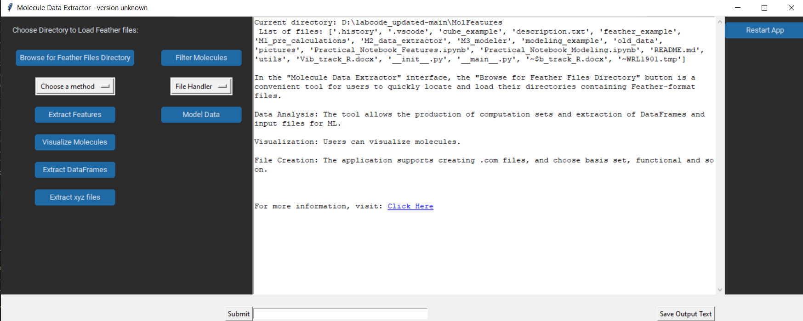
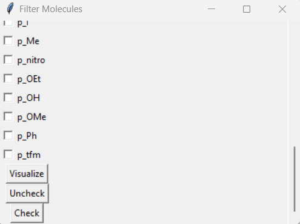
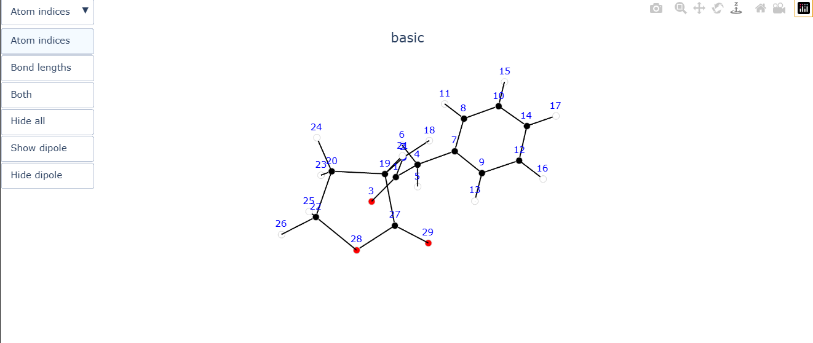
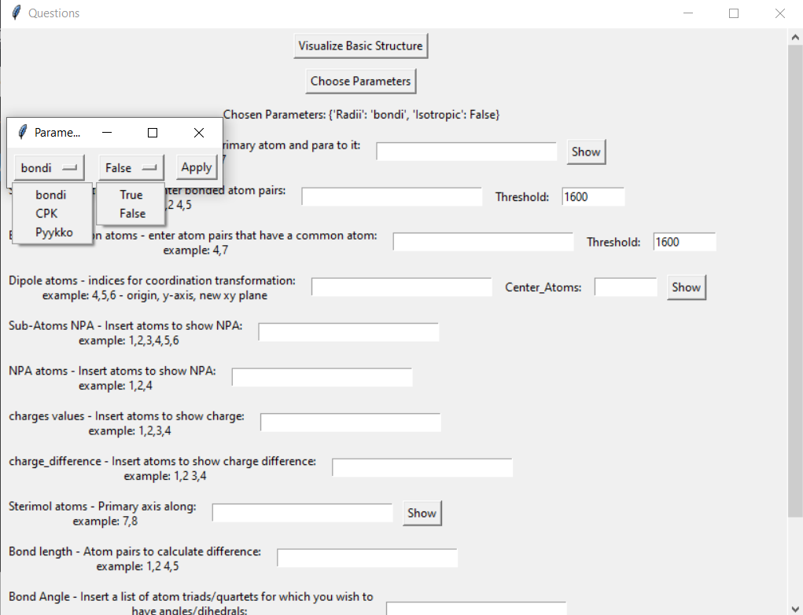
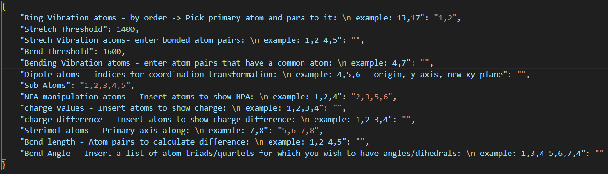
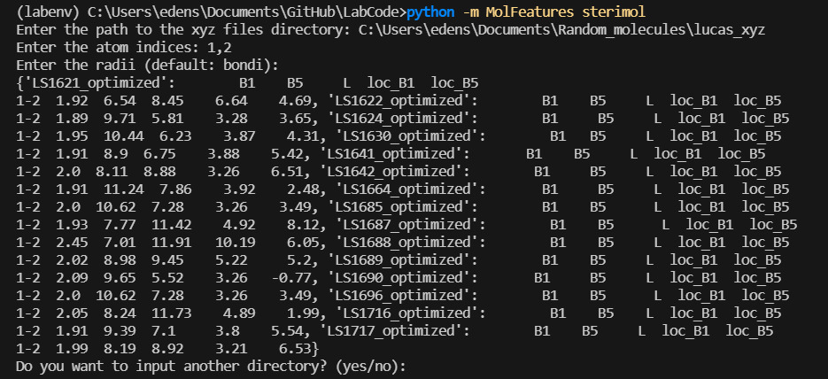
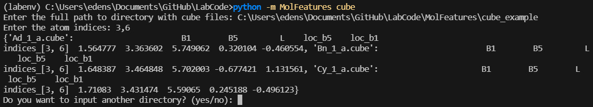

## GUI Usage

**Quick Start:** Run the following command in the `MolFeatures` directory:

```bash
python  __main__.py gui
```

**The following section focuses on using the GUI. For more advanced workflows, refer to the Practical Notebooks for feature extraction and modeling.**

---

<center></center>

Use **File Handler** to convert log files to feather format, or use the provided example feather files.

Next, move to **feature extraction**. By clicking **Browse feather directory**, users can select which molecules to load. A list of successfully loaded files will then appear:

```
Molecules initialized : ['basic', 'm_Br', 'm_Cl', 'm_F', 'm_I', 'm_nitro', 'o_Br', 'o_Cl', 'o_F', 'o_I', 'o_nitro', 'penta_F', 'p_amine', 'p_azide', 'p_boc', 'p_Br', 'p_Cl', 'p_F', 'p_I', 'p_Me', 'p_nitro', 'p_OEt', 'p_OH', 'p_OMe', 'p_Ph', 'p_tfm']

Failed to load Molecules: []
```

Now we can start performing other actions, such as visualizing one of the loaded structures. This visualization step helps in selecting atoms for the process of feature extraction.

<center></center>

<center></center>

---

## Features

When opening the **Feature Extraction** window, users are presented with multiple prompts to configure the extraction process. Each feature and its options are explained, with examples of expected input.

<center></center>

* **Visualize Basic Structure** – Displays the smallest molecule in the set.
* **Choose Parameters** – Options include:

  1. **Radii type** used for Sterimol calculations. Two systems are available:

     * **Pyykkö covalent radii** (default, complete for all elements)
     * **CPK/VDW radii** (defined only for a subset of elements)
  2. Option to include default values in extracted features.

**After selecting parameters, users can input atom indices for the desired features.**

* **Save input** creates a text file with chosen parameters and indices.
* **Load input** reloads these settings without re-entry.
* **Submit** displays results in the GUI dashboard and creates a `.csv` file containing extracted features.

It is recommended to **Save input/output** for reproducibility. Alongside the input text file, a `.csv` file with extracted descriptors will also be saved.

#### Inputs File

The inputs file is saved in plain text format. Users may manually edit atom indices in the dictionary. By choosing **Load input**, the GUI will populate indices in the relevant fields.

<center></center>
an example input file is located inside feather_example.
---

## Extractor
Another simple way to extract complete feature set is by using the extractor command.
```bash
python __main__.py extractor -h

usage: __main__.py extractor [-h] -i INPUT -o OUTPUT [-f FEATHER_DIRECTORY]

optional arguments:
  -h, --help            show this help message and exit
  -i INPUT, --input INPUT
                        Path to input file.
  -o OUTPUT, --output OUTPUT
                        Path to output file.
  -f FEATHER_DIRECTORY, --feather_directory FEATHER_DIRECTORY
                        Directory of feather files set to extract features from.
```
This option lets user who already have an input file, or already created one using the GUI to quickly load and extract the desired features.

Example:
```bash
python __main__.py extractor 
-i C:\Users\edens\Documents\GitHub\LabCode\MolFeatures\Getting_started_with_examples\feather_example\input_example.json
-o feature_set
-f C:\Users\edens\Documents\GitHub\LabCode\MolFeatures\Getting_started_with_examples\feather_example 
```

## Modeling

The user can run model searching from cmd with a simple command.
```bash
optional arguments: -h, --help show this help message and exit -m {regression,classification},
 --mode {regression,classification} Which task to run.
 -f FEATURES_CSV, --features_csv FEATURES_CSV Path to features CSV.
 -t TARGET_CSV, --target_csv TARGET_CSV Path to target/labels CSV.
 -y Y_VALUE, --y_value Y_VALUE Base name for target column in the csv.
 -j N_JOBS, --n_jobs N_JOBS Cores to use (-1 = all). If omitted, uses NSLOTS or all logical cores.
 --min-features MIN_FEATURES Minimum features per model.
 --max-features MAX_FEATURES Maximum features per model.
 --top-n TOP_N How many top models to keep/evaluate.
 --bool-parallel Enable parallel evaluation.
 --threshold THRESHOLD Initial threshold (regression(R2)/classification(mcfadden_R2)).
 --leave-out indices or molecules names to be used as external validation and prediction.
```


example : 
```bash
python __main__.py model -m classification -f C:\Users\edens\Documents\GitHub\LabCode\MolFeatures\Getting_started_with_examples\modeling_example\Logistic_Dataset_Example.csv -y class --n_jobs 1 --min-features 2 --max-features 4 --leave-out 1 2
```

## Sterimol from XYZ Files

Sterimol parameters can also be extracted directly from `.xyz` files without the need for logs or feather files.

```bash
# To calculate Sterimol features:
python  __main__.py sterimol
```

<center></center>

---

## Cube Sterimol

The generation of Sterimol values from density cube files is similar to the classic xyz-based approach. The main difference is that cube-based Sterimol accounts for stereo-electronic variations in atomic radii, whereas the tabulated radii used in the xyz-based method do not.

<center></center>
```bash
# To calculate Cube Sterimol features:
python  __main__.py cube
```


Top 5 models will be automatically saved in a pdf file format.

